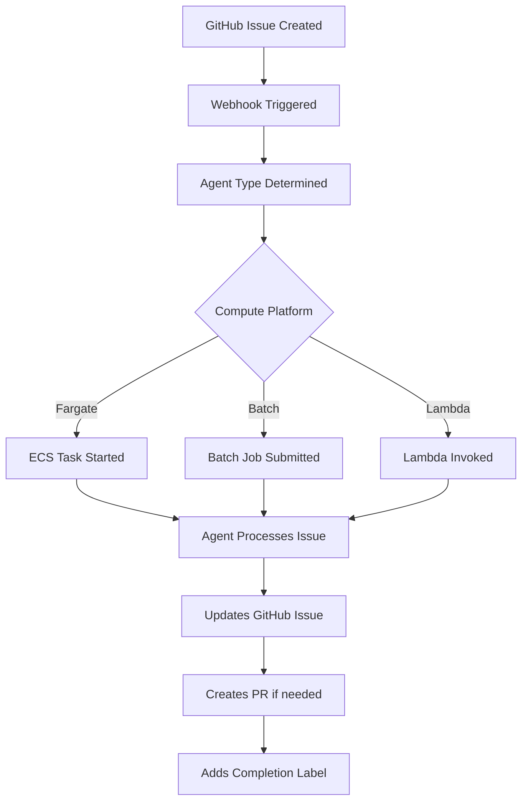
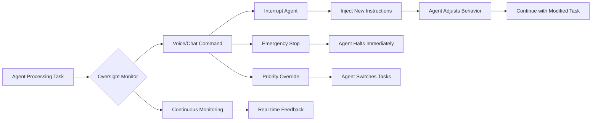

# NiroAgent System - Complete Agent Workflow Documentation

## Overview
The NiroAgent system runs AI agents as Docker containers on AWS EC2 instances, processing GitHub issues and executing tasks through various AWS compute platforms (Fargate, Batch, Lambda).

## How Agents Work

### 1. GitHub Issue Creation & Label-Based Assignment

#### Label-Only Routing (No Custom Fields)
The system uses **GitHub's native label system exclusively** for agent assignment - no custom fields or columns required. This keeps the system simple and maintainable.

- **Trigger**: User creates a GitHub issue with specific labels
- **Webhook**: GitHub sends webhook to `.github/workflows/ai-agent-processor.yml`
- **Agent Assignment**: Based purely on issue labels:
  - `bug`, `feature` → Developer Agent (Fargate)
  - `testing`, `qa` → QA Agent (Batch)
  - `deployment`, `infrastructure` → DevOps Agent (Fargate)
  - `security` → Security Agent (Fargate)
  - `architecture`, `design` → Architect Agent (Fargate)
  - `monitoring` → Operations Agent (Fargate)
  - `support` → Support Agent (Lambda)

#### Assignment Labels Added Automatically
- `assigned:{agent-name}` - Tracks which agent is assigned
- `priority:{P0-P3}` - Priority level
- `agent-assigned` - Indicates automated assignment
- `pm-approval:{status}` - PM oversight status

### 2. Agent Deployment Architecture

#### EC2 Container Instance
- **Instance ID**: `i-0af59b7036f7b0b77` (us-east-1)
- **Container Runtime**: Docker
- **Agent Management**: tmux sessions for each agent
- **Communication**: AWS SSM for remote commands

#### Container Structure
```dockerfile
FROM python:3.11-slim
WORKDIR /app
# Installs git, tmux, htop, curl
# Runs multiple agents in tmux sessions
# Each agent has unique ID and environment config
```

#### Agent Startup Process
1. GitHub Action uploads agent scripts to S3 bucket (`vf-dev-deployment/agents/`)
2. EC2 instance downloads scripts via AWS SSM
3. Scripts installed to `/opt/ai-agents/scripts/`
4. tmux sessions created for each agent type:
   - `qa-agent`: Runs Playwright tests
   - `dev-agent`: Fixes bugs and implements features
   - `ops-agent`: Monitors system health
   - `devops-agent`: Manages infrastructure
   - `security-agent`: Scans for vulnerabilities

### 3. Agent Capabilities & Instructions

#### Developer Agent (`ai-developer-agent.py`)
- **Capabilities**: Python/TypeScript code generation, FastAPI/Express development, test generation
- **AWS Policy**: Prioritizes serverless (Lambda → Fargate → ECS → EC2)
- **Instructions**: Receives GitHub issue → Generates code → Creates PR

#### QA Agent (`ai-qa-agent.py`)
- **Capabilities**: Playwright testing, API testing, performance testing
- **Instructions**: Monitors for test failures → Runs test suites → Reports results

#### DevOps Agent (`ai-devops-agent.py`)
- **Capabilities**: AWS infrastructure management, CI/CD pipelines, deployment
- **Instructions**: Handles deployment requests → Updates infrastructure → Monitors costs

#### Architect Agent (`ai-architect-agent.py`)
- **Capabilities**: System design, architecture patterns, technical specifications
- **Instructions**: Reviews architecture → Creates design docs → Validates patterns

### 4. Agent Execution Flow



### 5. Agent Communication Protocol

#### Input (GitHub Issue)
```json
{
  "repository": "NiroAgent/na-business-service",
  "issue_number": 123,
  "title": "Fix authentication bug",
  "body": "Users cannot login...",
  "labels": ["bug", "high-priority"],
  "agent_type": "developer"
}
```

#### Processing
1. Agent receives issue via environment variables
2. Authenticates with GitHub using token from AWS Secrets Manager
3. Analyzes issue content and requirements
4. Executes task based on agent capabilities
5. Updates issue with progress comments

#### Output (Agent Response)
```json
{
  "status": "completed",
  "pr_number": 456,
  "actions_taken": [
    "Analyzed authentication flow",
    "Fixed token validation",
    "Added unit tests",
    "Created pull request"
  ],
  "metrics": {
    "processing_time": "5m 23s",
    "lines_changed": 127,
    "tests_added": 8
  }
}
```

### 6. Real-time Monitoring & Control

The NA Agent Dashboard provides:
- **Live Agent Status**: Running/idle/processing states
- **Message Interface**: Send commands directly to agents
- **Task Submission**: Queue tasks for processing
- **Cost Tracking**: Monitor AWS resource usage
- **WebSocket Updates**: Real-time agent activity

### 7. Chat/Voice Agent Integration & Real-time Oversight

The system includes advanced oversight capabilities through chat/voice interfaces, allowing human operators to interrupt and redirect agents in real-time:

#### Oversight & Interrupt Capabilities
- **Real-time Agent Interruption**: Agents can be paused mid-task to receive new instructions
- **Voice Command Override**: Speak commands to instantly redirect agent behavior
- **Priority Injection**: Override GitHub issue priorities with voice/chat commands
- **Special Instructions**: Inject custom prompts during agent execution
- **Manual Control Takeover**: Human operators can assume direct control of agent sessions
- **Emergency Stop**: Voice command "STOP ALL AGENTS" halts all operations instantly

#### Communication Channels
- **Text Chat**: Real-time messaging with NLP processing for agent control
- **Voice Chat**: Speech-to-text for commands, text-to-speech for agent responses
- **PM Interface**: Delegation and oversight through conversational UI
- **Multi-platform**: Web, mobile (iOS/Android), desktop support
- **WebSocket**: Bi-directional real-time communication for instant response

#### Oversight Control Flow


#### Example Oversight Commands

##### Voice Commands
```bash
# Interrupt and redirect
"Agent developer, pause current task"
"Switch to critical security patch PR-456"
"Use TypeScript instead of Python"
"Resume with new instructions"

# Priority override
"All agents, prioritize production bug fixes"
"QA agent, run emergency regression tests now"

# Emergency control
"EMERGENCY STOP ALL AGENTS"
"Developer agent, rollback last deployment"
```

##### Chat Interface Commands
```javascript
// Direct agent control
/agent developer pause
/agent developer set-context "Use React hooks instead of class components"
/agent developer inject-prompt "Focus on performance optimization"
/agent developer resume

// Multi-agent coordination
/broadcast "All agents prepare for release deployment"
/agent qa priority high
/agent devops prepare-production

// Status and monitoring
/agent all status
/agent developer show-current-task
/agent architect review-progress
```

#### Implementation Architecture
```python
class OversightController:
    def __init__(self):
        self.websocket = WebSocketConnection()
        self.voice_interface = VoiceInterface()
        self.chat_interface = ChatInterface()
        
    async def handle_voice_command(self, audio):
        # Convert speech to text
        command = await self.voice_interface.speech_to_text(audio)
        
        # Parse and validate command
        if self.is_emergency_stop(command):
            await self.emergency_halt_all_agents()
        else:
            await self.process_oversight_command(command)
    
    async def interrupt_agent(self, agent_id, new_instructions):
        # Send interrupt signal to agent
        await self.websocket.send({
            'type': 'INTERRUPT',
            'agent_id': agent_id,
            'instructions': new_instructions,
            'priority': 'OVERRIDE'
        })
```

### 8. Deployment Commands

#### Deploy Agents to EC2
```bash
# Via GitHub Actions
gh workflow run deploy-real-agents.yml

# Direct deployment
aws ssm send-command \
  --instance-ids i-0af59b7036f7b0b77 \
  --document-name "AWS-RunShellScript" \
  --parameters 'commands=["sudo bash /opt/ai-agents/scripts/start-agents.sh"]'
```

#### Monitor Agent Logs
```bash
# View tmux sessions
aws ssm send-command \
  --instance-ids i-0af59b7036f7b0b77 \
  --document-name "AWS-RunShellScript" \
  --parameters 'commands=["tmux list-sessions"]'

# Attach to specific agent
aws ssm start-session --target i-0af59b7036f7b0b77
sudo -u agent tmux attach -t qa-agent
```

## Security & Compliance

- **Secrets Management**: GitHub tokens stored in AWS Secrets Manager
- **IAM Roles**: Least-privilege access for each agent type
- **Network Security**: VPC isolation, security groups
- **Audit Logging**: CloudTrail for all agent actions
- **Policy Engine**: Validates agent actions against compliance rules

## Cost Optimization

- **Spot Instances**: Agents run on spot instances when possible
- **Auto-scaling**: Scale agents based on issue queue
- **Resource Limits**: CPU/memory limits per agent
- **Idle Timeout**: Agents terminate after inactivity
- **Batch Processing**: Group similar tasks for efficiency

## Next Steps

1. **Enhance Agent Intelligence**: Integrate more sophisticated AI models
2. **Expand Agent Types**: Add specialized agents (ML, Data, Mobile)
3. **Improve Chat Interface**: Complete voice/text chat implementation
4. **Multi-tenant Support**: Allow multiple organizations
5. **Advanced Orchestration**: Complex multi-agent workflows