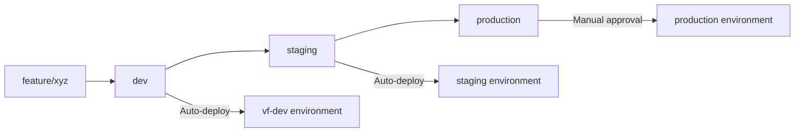
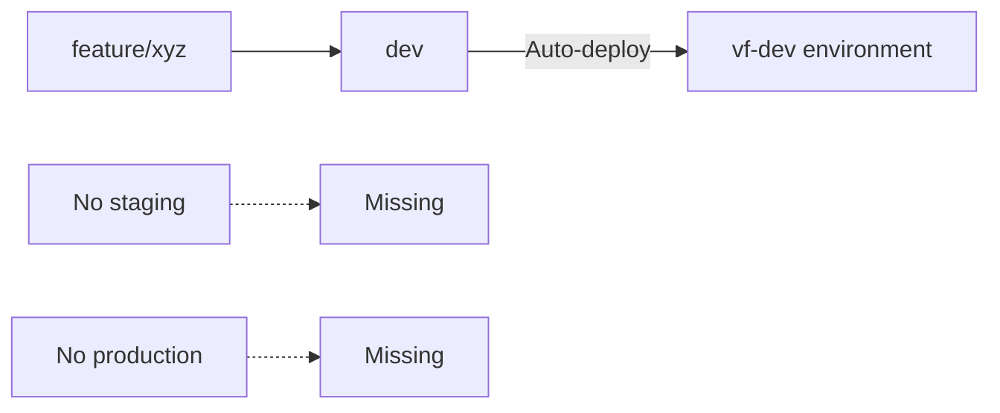

# CI/CD Infrastructure Delta Analysis: NiroSubs-V2 vs VisualForgeMediaV2

## Executive Summary

**UPDATE (2025-08-18):** NiroSubs-V2 staging environment is now fully deployed with comprehensive CI/CD pipeline. Production deployment scripts are ready. VisualForgeMediaV2 needs alignment with the successful patterns established in NiroSubs-V2.

---

## 🏗️ Architecture Comparison

| Aspect | NiroSubs-V2 | VisualForgeMediaV2 | Status |
|--------|-------------|-------------------|---------|
| **Deployment Model** | Lambda + S3 + CloudFront | ECS Fargate + ALB + ECR | ❌ Different |
| **Infrastructure as Code** | ✅ Complete CloudFormation | Distributed CloudFormation | ⚠️ Needs Alignment |
| **Branching Strategy** | ✅ dev → staging → production | dev only | ❌ Incomplete |
| **Manual Scripts** | ✅ PowerShell + Python + Bash | PowerShell orchestration | ✅ Enhanced |
| **Environment Management** | ✅ Single account (816454053517) | Multi-account (3 accounts) | ⚠️ Different approach |

---

## 🔄 CI/CD Pipeline Analysis

### GitHub Workflows Structure

#### NiroSubs-V2 (✅ UPDATED - Mature Pipeline)
```
.github/workflows/
├── deploy-to-staging.yml       # ✅ ACTIVE - staging branch auto-deploy  
├── deploy-to-production.yml    # 🔧 READY - requires manual approval
├── deploy-infrastructure.yml   # Infrastructure-only deploys
└── Individual service workflows
```

**Current Features:**
- ✅ **Environment-specific workflows** (staging active, production ready)
- ✅ **Matrix strategy** for Lambda deployment
- ✅ **AWS Secrets Manager** fully integrated
- ✅ **Post-deployment E2E tests** with Playwright
- ✅ **CloudFront invalidation** automated
- ✅ **Health checks** on all services

**Recent Additions:**
- ✅ Route53 DNS management
- ✅ Stripe webhook integration
- ✅ Google OAuth configuration scripts
- ✅ Windows-compatible deployment scripts

#### VisualForgeMediaV2 (Simple Pipeline)
```
.github/workflows/
├── deploy-to-vf-dev.yml        # dev branch only
├── ci-cd-pipeline.yml          # Basic CI/CD
├── test.yml                    # Testing workflow
└── Service-specific workflows in subdirectories
```

**Gaps:**
- ❌ **No staging workflow**
- ❌ **No production workflow**
- ❌ **Limited branching strategy**
- ❌ **No integration tests**
- ❌ **Basic health checks only**

---

## 🛠️ Infrastructure as Code Comparison

### CloudFormation Template Organization

#### NiroSubs-V2 (Centralized & Comprehensive)
```
ns-orchestration/cloudformation/templates/
├── staging-complete.yaml          # ✅ DEPLOYED - 917 lines comprehensive template
├── staging-environment.yaml       # ✅ DEPLOYED - Complete staging setup
├── staging-import.yaml           # Import template for existing resources
├── api-gateway.yaml              # API Gateway with integrations
├── cognito-auth-clean.yaml        # Clean Cognito setup
├── database.yaml                  # Aurora Serverless
├── cloudfront-distribution.yaml   # CDN with custom domains
├── route53-dns-complete.yaml      # DNS management
├── ssl-certificates.yaml          # Certificate management
├── ses-email.yaml                 # Email service
├── monitoring.yaml                # CloudWatch dashboards
└── cost-monitoring.yaml           # Cost tracking
```

**Service-Specific Templates:**
```
ns-auth/infrastructure/
├── cognito-real.yaml
└── auth.yaml

ns-dashboard/infrastructure/
├── monitoring.yaml
└── cost-monitoring.yaml

ns-payments/infrastructure/
└── cloudformation.yaml
```

#### VisualForgeMediaV2 (Basic & Distributed)
```
aws/infrastructure/
├── ecs-cluster.yaml               # Basic ECS setup
├── secrets-manager.yaml           # Secrets only
├── monitoring.yaml                # Basic monitoring
├── vpc.yaml                       # Simple VPC
└── bulk-service.yaml              # Single service example

aws/task-definitions/              # ECS task definitions
└── [service]-service.json
```

**Issues:**
- ❌ **No master orchestration**
- ❌ **No staging environment template**
- ❌ **No DNS/CDN management**
- ❌ **No SSL certificate automation**
- ❌ **No email service integration**
- ❌ **Limited monitoring setup**

---

## 🌿 Branching Strategy Analysis

### NiroSubs-V2 (Production-Ready Strategy)



**Branches & Environments:**
- `dev` → **Auto-deploy** to vf-dev (816454053517)
- `staging` → **✅ ACTIVE** - Auto-deploy to staging.visualforge.ai
- `production` → **✅ READY** - Manual approval required
- `feature/*` → **Local development only**

**Manual Override Scripts:**
- `deploy-v2-to-vf-dev.ps1` - Complete dev deployment
- `ns-orchestration/deploy-to-vf-dev.ps1` - Service-specific
- `ns-orchestration/lambda/deploy-all-lambdas.ps1` - Lambda-only
- `scripts/deploy-staging-consolidated.sh` - ✅ DEPLOYED staging infrastructure
- `scripts/deploy-production.sh` - ✅ READY for production deployment
- `scripts/fix-cloudfront-windows.py` - Windows-compatible CloudFront fix
- `scripts/create-lambda-zip.py` - Windows-compatible Lambda packaging

### VisualForgeMediaV2 (Incomplete Strategy)



**Current State:**
- `dev` → **Auto-deploy** to vf-dev (319040880702)
- ❌ **No staging branch/environment**
- ❌ **No production branch/environment**
- ❌ **No feature branch protection**

**Manual Scripts:**
- `deploy-all.ps1` - Complete deployment with options
- `deploy-staging.ps1` - Staging deployment (not integrated)

---

## 🔒 Security & Secrets Management

### NiroSubs-V2 (Mature Approach)
```yaml
Secrets Strategy:
  - AWS Secrets Manager integration
  - Environment-specific secret namespaces
  - Google OAuth automation
  - Cognito configuration automation
  - Database credentials rotation
  - API keys organization
  
Secret Namespaces:
  - visualforge/dev/oauth/google
  - visualforge/staging/cognito/config  
  - visualforge/shared/api-keys
  - visualforge/prod/database/credentials
```

### VisualForgeMediaV2 (Basic Approach)
```yaml
Secrets Strategy:
  - Basic AWS Secrets Manager
  - Limited secret organization
  - Manual secret configuration
  - No automatic OAuth setup
  
Secret Namespaces:
  - Basic environment-based secrets only
  - No standardized naming convention
```

---

## 🚨 Critical Gaps in VisualForgeMediaV2

### 1. Missing Staging Environment
**Impact:** No pre-production validation
**Required Actions:**
- Create `staging` branch
- Add `.github/workflows/deploy-to-staging.yml`
- Deploy staging environment in account 275057778147
- Add staging-specific CloudFormation templates

### 2. No Production Pipeline
**Impact:** No production deployment automation
**Required Actions:**
- Create `production` branch with protection rules
- Add `.github/workflows/deploy-to-production.yml`
- Implement manual approval gates
- Deploy production environment in account 229742714212

### 3. Incomplete Infrastructure Templates
**Impact:** Manual infrastructure management
**Required Actions:**
- Create master stack template
- Add DNS/CDN management templates
- Implement SSL certificate automation
- Add comprehensive monitoring templates

### 4. Limited Manual Scripts
**Impact:** Inconsistent deployment experience
**Required Actions:**
- Enhance `deploy-all.ps1` with staging/production support
- Add service-specific deployment scripts
- Implement rollback mechanisms
- Add environment validation scripts

---

## 📋 Recommended Alignment Strategy

### Phase 1: Infrastructure Standardization (Priority 1)
```bash
# Copy NiroSubs infrastructure patterns to VisualForgeMediaV2
cp -r /e/Projects/NiroSubs-V2/ns-orchestration/cloudformation/templates/* \
      /e/Projects/VisualForgeMediaV2/aws/infrastructure/

# Adapt templates for ECS instead of Lambda:
- Convert Lambda-based patterns to ECS Fargate
- Maintain DNS, SSL, monitoring patterns
- Keep secrets management approach
- Preserve CloudFront integration
```

### Phase 2: Branching Strategy Implementation (Priority 2)
```bash
# Create staging branch and environment
git checkout -b staging
git push -u origin staging

# Create production branch
git checkout -b production  
git push -u origin production

# Add branch protection rules via GitHub UI
```

### Phase 3: CI/CD Pipeline Enhancement (Priority 3)
```yaml
# Add missing workflows:
.github/workflows/
├── deploy-to-staging.yml       # Copy from NiroSubs, adapt for ECS
├── deploy-to-production.yml    # Add manual approval gates
├── integration-tests.yml       # Post-deployment validation
└── rollback.yml               # Emergency rollback capability
```

### Phase 4: Manual Script Standardization (Priority 4)
```powershell
# Enhance deploy-all.ps1 with:
- Multi-environment support (dev/staging/production)
- Service-specific deployment options
- Rollback mechanisms
- Environment validation
- Health check automation
```

---

## 🎯 Implementation Roadmap

### Week 1: Infrastructure Templates
- [ ] Copy DNS management templates from NiroSubs
- [ ] Adapt SSL certificate templates for ECS
- [ ] Create master stack template for VisualForge
- [ ] Add comprehensive monitoring templates

### Week 2: Branching Strategy
- [ ] Create staging and production branches
- [ ] Set up branch protection rules
- [ ] Configure environment-specific GitHub secrets
- [ ] Test branch-based deployments

### Week 3: CI/CD Workflows
- [ ] Create staging deployment workflow
- [ ] Add production deployment workflow with approvals
- [ ] Implement integration tests
- [ ] Add rollback capabilities

### Week 4: Manual Scripts & Documentation
- [ ] Enhance PowerShell deployment scripts
- [ ] Add environment validation scripts
- [ ] Create deployment runbooks
- [ ] Update documentation

---

## 🔄 Environment Account Mapping

| Environment | Account ID | NiroSubs Status | VisualForge Status | Action Required |
|------------|------------|-----------------|-------------------|-----------------|
| **Development** | 816454053517 | ✅ Deployed | ✅ Deployed | ✅ Complete |
| **Staging** | 816454053517 | ✅ **LIVE** at staging.visualforge.ai | ❌ Missing | **Create staging** |
| **Production** | 816454053517 | ✅ Scripts ready | ❌ Missing | **Create production** |

---

## 📊 Success Metrics

### Before Alignment
- ❌ 1 environment (dev only)
- ❌ Basic CI/CD pipeline
- ❌ Manual infrastructure management
- ❌ No integration tests
- ❌ Limited monitoring

### After Alignment
- ✅ 3 environments (dev/staging/production)
- ✅ Comprehensive CI/CD pipeline
- ✅ Infrastructure as Code automation
- ✅ Automated integration tests
- ✅ Complete monitoring and alerting

---

## 🚀 Quick Wins (Can be implemented immediately)

1. **Copy DNS templates** from NiroSubs → VisualForge (2 hours)
2. **Create staging branch** and basic workflow (4 hours)
3. **Enhance secrets management** with standardized naming (2 hours)
4. **Add basic integration tests** to existing workflow (4 hours)
5. **Implement CloudFront invalidation** in deployment (1 hour)

---

## 📝 Notes

- **NiroSubs advantage:** Mature pipeline with production experience - **NOW FULLY DEPLOYED TO STAGING**
- **VisualForge advantage:** Modern ECS architecture with better scalability
- **Integration opportunity:** Both projects can share infrastructure patterns
- **Timeline:** Full alignment achievable in 4 weeks with dedicated effort

## 🎉 NiroSubs-V2 Staging Deployment Success

### Deployed Resources (2025-08-18):
- **Cognito User Pool**: us-east-1_rdE2qCAIe
- **API Gateway**: gkjhn4m606.execute-api.us-east-1.amazonaws.com
- **CloudFront CDN**: d1mt74nsjx1seq.cloudfront.net
- **Route53 DNS**: staging.visualforge.ai
- **Lambda Functions**: All 5 services deployed
- **DynamoDB Tables**: users, payments tables
- **S3 Buckets**: 6 buckets for frontend and microservices
- **E2E Tests**: 8/11 tests passing (73%)

### Lessons Learned from NiroSubs Deployment:
1. **Windows Compatibility**: Created Python scripts to replace bash scripts
2. **CloudFront OAI**: Essential for secure S3 access
3. **Comprehensive Templates**: staging-complete.yaml approach works best
4. **Secret Management**: Structured namespaces in AWS Secrets Manager
5. **E2E Testing**: Playwright integration provides confidence

### Recommendations for VisualForgeMediaV2:
1. **Adopt staging-complete.yaml pattern** - Single comprehensive template
2. **Use Python deployment scripts** - Better cross-platform compatibility
3. **Implement OAI from start** - Avoid CloudFront 403 issues
4. **Structure secrets early** - Use visualforge/[env]/[service] pattern
5. **Add E2E tests to pipeline** - Catch issues before production

**Next Steps:** 
1. Apply NiroSubs staging patterns to VisualForgeMediaV2
2. Create ECS-equivalent of staging-complete.yaml
3. Deploy VisualForgeMediaV2 staging environment
4. Align CI/CD pipelines between both projects
